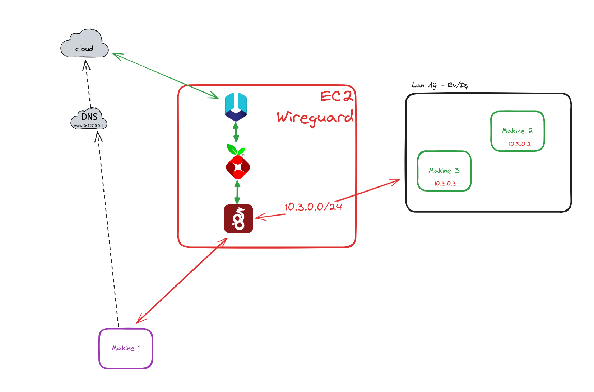

## What is this?

WireHole is a docker-compose project that combines WireGuard, PiHole, and Unbound to create a full or split-tunnel VPN that is easy to deploy and manage. This setup allows for a VPN with ad-blocking via PiHole and enhanced DNS privacy and caching through Unbound.

## Author

👤 **Metin Karakus**

- Profile: [@MetinKarakus](https://bit.ly/m/metinkarakus)

## 🤝 Contributing

Contributions, issues, and feature requests are welcome! Feel free to check the [issues page](https://github.com/m-karakus/wirehole/issues).

## Show your support

Give a ⭐ if this project helped you!

---

### Quickstart

#### 1. Install Docker 

```bash
# Add Docker's official GPG key:
sudo apt-get update
sudo apt-get install ca-certificates curl gnupg
sudo install -m 0755 -d /etc/apt/keyrings
curl -fsSL https://download.docker.com/linux/ubuntu/gpg | sudo gpg --dearmor -o /etc/apt/keyrings/docker.gpg
sudo chmod a+r /etc/apt/keyrings/docker.gpg
```  

```bash
# Add the repository to Apt sources:
echo \
  "deb [arch="$(dpkg --print-architecture)" signed-by=/etc/apt/keyrings/docker.gpg] https://download.docker.com/linux/ubuntu \
  "$(. /etc/os-release && echo "$VERSION_CODENAME")" stable" | \
  sudo tee /etc/apt/sources.list.d/docker.list > /dev/null
```  

```bash
# Install docker
sudo apt-get update
sudo apt-get install docker-ce docker-ce-cli containerd.io docker-buildx-plugin docker-compose-plugin
sudo groupadd docker
sudo usermod -aG docker $USER
newgrp docker
sudo chown "$USER":"$USER" /home/"$USER"/.docker -R
sudo chmod g+rwx "$HOME/.docker" -R
sudo systemctl enable docker.service
sudo systemctl enable containerd.service
```

#### 2. Deploy The Wirehole

To begin using WireHole, clone the repository and start the containers:

```bash
#!/bin/bash

# Clone the WireHole repository from GitHub
git clone https://github.com/m-karakus/wirehole.git

# Change directory to the cloned repository
cd wirehole

# Update the .env file with your configuration
nano .env  # Or use any text editor of your choice to edit the .env file

# Start the Docker containers
docker compose up
```

Remember to set secure passwords for  `WG_PASSWORD`, and `PIHOLE_PASSWORD` in your `.env` file.


---

## Environment Configuration Details

The `.env` file contains a series of environment variables that are essential for configuring the WireHole services within the Docker containers. Here is a detailed explanation of each variable:

### General Settings

*Update the `.env` file.*

- `MASTER` is your public ip or domain.
- `WG_PASSWORD` is wireguard UI password.
- `PIHOLE_PASSWORD` pihole UI password.

### WireGuard Settings

- After the `docker compose up` or deploy, open your browser and go to <http://YOUR_PUBLIC_IP:51821/>
- Login with your password, which is in the `.env`
- Create new connection keys/QR codes...


### Pi-hole Settings

- Connect to VPN with created client QR code or conf file and then go to this address on your browser <http://10.2.0.100/admin>
- Login with your password, which is in the `.env`

---

### Recommended Configuration / Split Tunnel

For a split-tunnel VPN, configure your WireGuard client `AllowedIps` to `10.3.0.0/24`, which will route only the web panel and DNS traffic through the VPN.

---

### VPN Example Structure 




###### Acknowledgements

Credit to LinuxServer.io for their maintenance of the Wireguard image and other contributions to the project.
